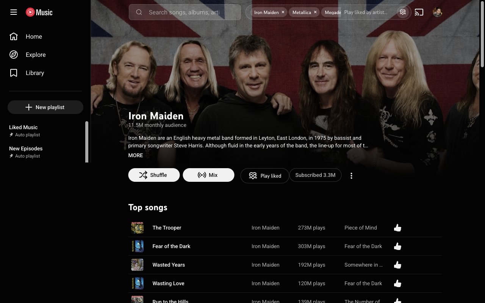
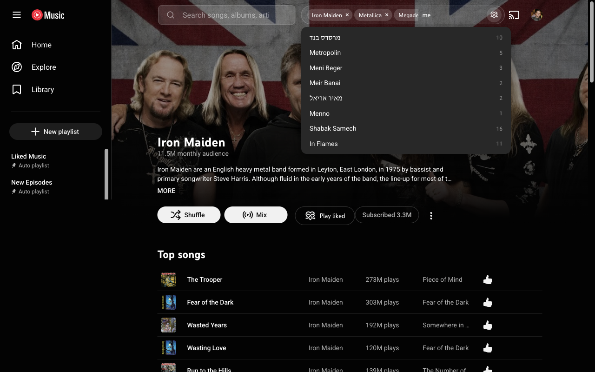

  

<h1 align="center">YouTube Music — Play Liked by Artist</h1>

  Shuffle-play the songs <em>you've</em> liked on
  <a href="https://music.youtube.com">YouTube Music</a> — by one artist, or several at once.

YouTube Music lets you *like* songs, but it won't play back just your liked songs
from a given artist. This extension adds exactly that, in two places.

## Features

- **"Play liked" button on any artist page** — one click shuffle-plays only the
  songs you've liked by that artist.
- **Artist picker next to the search bar** — type artists, add several as tags,
  press play, and it shuffle-plays the **combined** set of your liked songs by
  all of them. Suggestions come only from artists you've actually liked, so every
  pick has songs (and it matches across name spellings — e.g. "Korol i Shut" and
  "Король и Шут" are one entry). The selection clears when playback starts.

## Screenshots

## Install

**From the Chrome Web Store:** _(link coming once published)_

**Unpacked (for development):**

1. Open `chrome://extensions`.
2. Turn on **Developer mode** (top-right).
3. Click **Load unpacked** and select this folder (the one with `manifest.json`).
4. Open <https://music.youtube.com> (signed in). The **Play liked** button
   appears on artist pages, and the artist bar appears to the right of the
   search box.

> After changing code, click the reload icon on the extension card in
> `chrome://extensions`, then reload the YouTube Music tab — a page reload alone
> serves the cached content script.

## How it works

| File | Role |
| --- | --- |
| `src/content.js` | Injects both UIs (SPA-aware), builds the artist index from your likes, and orchestrates play: fetch → filter → shuffle → hand off. |
| `src/main-world.js` | Runs in the page's MAIN world to read YouTube's `ytcfg` (InnerTube API key + client context) and relays it to `content.js`. |
| `src/background.js` | Builds a temporary playlist from the shuffled video IDs (a cross-origin call the page can't make). |
| `src/inject.css` | Styling for the button, artist bar, dropdown, and toast. |

In short: it reads your **Liked Music** (`browseId: VLLM`) via YouTube's own
InnerTube API using your existing session, keeps only the songs by the chosen
artist(s), shuffles them, mints a temporary `watch_videos` playlist, and
navigates to it. The full liked list is cached locally (`chrome.storage.local`,
12h) so repeat use is instant. See [CLAUDE.md](CLAUDE.md) for the detailed
architecture and the YouTube-internals gotchas.

## Privacy

Everything runs locally in your browser. The extension reads your liked songs
through YouTube Music's own API (using the session you're already signed in to)
and caches them on your device. It sends **nothing** to the developer or any
third party — no servers, no analytics, no tracking. See [PRIVACY.md](PRIVACY.md).

## Status

v0.4.0 — pre-release. Not affiliated with, endorsed by, or sponsored by YouTube
or Google. "YouTube Music" is a trademark of Google LLC.
